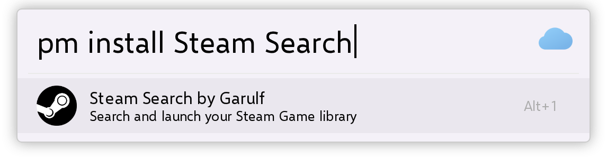

# web-render

Renders a Flow Launcher search-result mockup to HTML, screenshots it headlessly with
Playwright, and crops the result to a transparent PNG — useful for generating plugin
screenshots for READMEs and store listings without staging a real launcher window.



## How it works

1. A `Config` (from a JSON file, or built by running a real plugin) describes the
   search bar and its results.
2. `renderer.py` renders `templates/base.html` with Jinja2 into `build/output.html`.
3. `screenshot.py` loads that file in headless Chromium and screenshots it with a
   transparent background.
4. `image.py` crops to the smallest bounding box and writes
   `output/output_<timestamp>_<id>.png`.

`build/` is wiped on every run; `output/` accumulates.

## Requirements

- Python 3.10+
- Chromium via Playwright (installed automatically by the run scripts)

## Install

Install as a standalone CLI with [uv](https://docs.astral.sh/uv/):

```bash
uv tool install .
playwright install chromium
web-render -c ./example/config.json
```

## Usage

### Linux / macOS / WSL

```bash
make run CONFIG=./example/config.json
```

Other targets and variables:

```bash
make help
make run PLUGIN=./path/to/plugin QUERY=test
make run PLUGIN_MANAGER=1 PLUGIN=./path/to/plugin
make run CONFIG=./example/config.json SKIP_PLAYWRIGHT=1   # skip the Chromium install step
```

`make` creates `.venv`, installs the package with `uv pip install -e .`, and installs
Chromium on first run; later runs reuse the existing venv.

### Windows

```powershell
.\run.ps1 -c .\example\config.json
```

`run.ps1` does the same venv + Playwright bootstrap, prompting for elevation only if
the Chromium install needs it, then forwards all arguments to the CLI.

### Direct CLI

```bash
web-render -c ./example/config.json
```

| Flag | Meaning |
| --- | --- |
| `-c`, `--config` | Path to a config JSON file |
| `-p`, `--plugin` | Path to a Flow Launcher plugin directory (read via its `plugin.json`) |
| `-u`, `--plugin-url` | URL or local path to a plugin `.zip`; extracted to a temp dir and used like `-p` |
| `-q`, `--query` | Query to run against the plugin |
| `-i` | Render the plugin-manager view for the given plugin |

With `-p`, the plugin's `ExecuteFileName` is invoked as a subprocess with a
`{"method": "query", "parameters": [query]}` request and its results become the
rendered rows. `-u` is mutually exclusive with `-p` — the zip is extracted to a
temporary directory (its `plugin.json` is located automatically, even if the zip
wraps everything in a subfolder), then handled exactly like `-p`.

## Config format

See `example/config.json`:

```json
{
    "keyword": "pm",
    "query": "install Steam Search",
    "icon": "data:image/png;base64,...",
    "max_results": 1,
    "selection": 0,
    "css": null,
    "query_suggestion": "",
    "results": [
        {
            "title": "Steam Search by Garulf",
            "subtitle": "Search and launch your Steam Games",
            "icon": "data:image/png;base64,..."
        }
    ]
}
```

- `icon` accepts a data URI or a path relative to the config file — relative paths are
  resolved and inlined automatically.
- `selection` is the index of the highlighted row.
- `query_suggestion` is auto-filled from the selected result's title when left empty.
- `css` names a stylesheet to inline on top of the default `style.css` (its rules win
  the cascade). It is looked
  up relative to the working directory first, then in the bundled `static/`, where several
  variants ship (`hero.css`, `hero1.css` … `hero4.css`, `style.css`, `win11-light.css`,
  `win11-dark.css` — the last two mimic Flow Launcher's "Windows 11" theme). Templates resolve
  the same way, so a local `base.html` overrides the bundled one.
- Generated Flow Launcher themes live in the bundled `static/themes/` — use them with
  `"css": "themes/dracula.css"` (or `themes/win11light-dark.css`, etc.).
  Regenerate them from the current Flow Launcher release with `make themes`,
  which refreshes the vendored XAML in `themes/xaml/` and rewrites the CSS.
